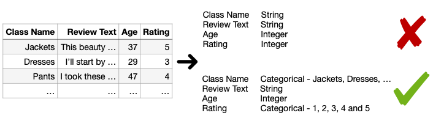

.. image:: https://github.com/alan-turing-institute/ptype/workflows/build-publish/badge.svg?branch=release
    :target: https://github.com/alan-turing-institute/ptype/actions?query=workflow%3Abuild-publish+branch%3Arelease
    :alt: build-publish on release

.. image:: https://github.com/alan-turing-institute/ptype/workflows/build/badge.svg?branch=develop
    :target: https://github.com/alan-turing-institute/ptype/actions?query=workflow%3Abuild+branch%3Adevelop
    :alt: build on develop

.. image:: https://badge.fury.io/py/ptype.svg
    :target: https://badge.fury.io/py/ptype
    :alt: PyPI version

.. image:: https://readthedocs.org/projects/ptype/badge/?version=stable
    :target: https://ptype.readthedocs.io/en/stable/
    :alt: Documentation status

.. image:: https://pepy.tech/badge/ptype
    :target: https://pepy.tech/project/ptype
    :alt: Downloads

.. image:: https://mybinder.org/badge_logo.svg
    :target: https://mybinder.org/v2/gh/alan-turing-institute/ptype/release?filepath=notebooks
    :alt: Binder

============
Introduction
============

.. sectnum::

.. contents::

This repository provides the source code of a Python package for ptype and its extension ptype-cat.

+++++++++++++++
ptype
+++++++++++++++
ptype is a probabilistic approach to *type inference*, which is the task of identifying the data type (e.g. Boolean, date, integer or string) of a given column of data.

Existing approaches often fail on type inference for messy datasets where data is missing or anomalous. With ptype_, our goal is to develop a robust method that can deal with such data.

.. figure:: https://raw.githubusercontent.com/alan-turing-institute/ptype/release/notes/motivation.png
    :width: 400

    Normal, missing and anomalous values are denoted by green, yellow and red, respectively in the right hand figure.

.. _ptype: https://link.springer.com/content/pdf/10.1007/s10618-020-00680-1.pdf

ptype uses `Probabilistic Finite-State Machines`_ (PFSMs) to model known data types, missing and anomalous data. Given a column of data, we can infer a plausible column type, and also identify any values which (conditional on that type) are deemed missing or anomalous. In contrast to more familiar finite-state machines, such as regular expressions, that either accept or reject a given data value, PFSMs assign probabilities to different values. They therefore offer the advantage of generating weighted predictions when a column of messy data is consistent with more than one type assignment.

.. _`Probabilistic Finite-State Machines`: https://en.wikipedia.org/wiki/Probabilistic_automaton

If you use this package, please cite the `ptype paper`_, using the following BibTeX entry:

.. _`ptype paper`: http://doi.org/10.1007/s10618-020-00680-1

::

    @article{ceritli2020ptype,
      title={ptype: probabilistic type inference},
      author={Ceritli, Taha and Williams, Christopher K I and Geddes, James},
      journal={Data Mining and Knowledge Discovery},
      year={2020},
      volume = {34},
      number = {3},
      pages={870–-904},
      doi = {10.1007/s10618-020-00680-1},
    }

+++++++++++++++
ptype-cat
+++++++++++++++
Automatic identification of the categorical type from the data in a column
is challenging because the values may be encoded as strings or
integers. Recall that ptype can identify Boolean variables; however, it does not handle non-Boolean categorical variables
where there are more than two possible values. For example, most existing methods including ptype respectively
treat the "``Class Name``" and "``Rating``" columns as integer and string
rather than categoricals. Therefore, the user needs to manually convert their assigned types.

    The data on the left-hand side are sampled from `a dataset about clothing`_.

To (semi-)automate this manual task, we introduce ptype-cat, which is an extension to ptype to detect the general
categorical type including the non-Boolean categorical variables. ptype-cat combines the output of ptype with
additional features such as the number of unique values in a column and runs a Logistic Regression classifier to
determine whether a column denotes a categorical variable or not when a column is labeled with the integer or
string type by ptype.

Please see the `ptype-cat paper`_ for the details of ptype-cat, for which you can use
the following BibTeX entry to cite:

.. _`ptype-cat paper`: https://www.google.com/url?q=https%3A%2F%2Fupvedues-my.sharepoint.com%2F%3Ab%3A%2Fg%2Fpersonal%2Fjorallo_upv_edu_es%2FER3GUrAraHRJmzdvbnJ75LgBB1fgbwHlWAbdcxjxMij-vQ%3Fe%3DfUOZ9K&sa=D&sntz=1&usg=AFQjCNH-zU7Vk-_I5M6MFaXL6-nn72zYFQ
.. _`a dataset about clothing`: https://www.kaggle.com/nicapotato/womens-ecommerce-clothing-reviews

::

    @inproceedings{ptype-cat,
      title={ptype-cat: Inferring the Type and Values of Categorical Variables},
      author={Ceritli, Taha and Williams, Christopher K I},
      booktitle={21st ECML-PKDD Automating Data Science Workshop},
      year={2021},
    }

====================
Install requirements
====================

You can simply install ptype from PyPI:

.. code:: bash

    pip install ptype

=====
Usage
=====

See demo notebooks in ``notebooks`` folder. View them online via Binder_.

.. _Binder: https://mybinder.org/v2/gh/alan-turing-institute/ptype/release?filepath=notebooks
